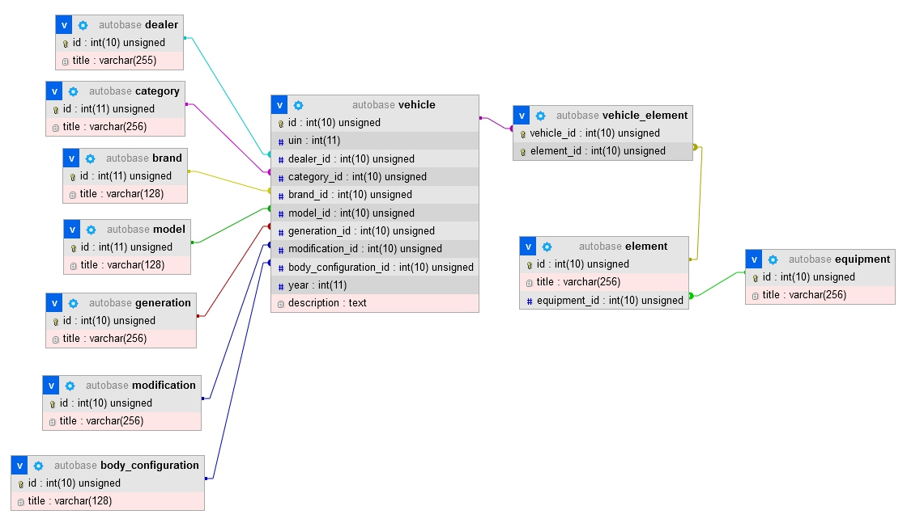

Задание
---
Stack: PHP 7.4+, MySQL 5.7+

Frameworks: Нативный PHP, либо Laravel.

Разработать архитектуру БД на основе XML-выгрузки.

Написать парсер XML-выгрузки для добавления, изменения и удаления данных из базы.
Парсер должен запускаться через консольную команду. При вызове консольной команды должна быть
возможность указать путь до файла выгрузки, при этом, если путь до файла не указан, то берется дефолтный
файл.
---

## Архитектура БД

1. Реализованы связи OneToMany и ManyToMany (одна сущность - vehicle-element).

2. Связанные таблицы созданы для элементов XML-файла, где есть атрибут id. Для улучшения архитектуры возможно также добавить внешние таблицы для ряда других полей, например gearboxType, bodyDoorCount, bodyColor, steeringWheel и прочее, где есть простое перечисление из нескольких вариантов.

3. В основную таблицу Vehicle добавлены не все простые поля, только несколько для демонстрации.

Общий вид БД

---
## Приложение

1. Формат запуска и параметры
- php parser.php - парсинг из файла по умолчанию
- php parser.php <путь> - указание на альтернативный путь к источнику
- php parser.php delete-all - удаление всех данных об автомобилях (очистка осн. таблицы)
- php parser.php delete < id > - удаление строки с указанным id

2. Настройки. Парсер конфигурируется в файле main/config - указывается источник по умолчанию, подключения к БД, а также компоненты приложения.

3. Возможность расширения и настройки. Приложение имеет гибкую архитектуру. Работа с БД осуществляется с помощью ORM-моделей. Для добавления новой таблицы нужно добавить классы репозитория и сущности. Для простых таблиц id/title можно использовать типовую сущность OneToMany. Поля для парсинга прописываются в компоненте services/XMLParser.

4. Реализован паттерн DI, что даёт возможность сравнительно простого подключения новых компонентов в приложение.

5. Перед началом парсинга приложение загружает все связанные таблицы и в случае появления новых атрибутов, добавляет их.

6. Для оптимизации работы с БД реализовано множественное добавление элементов для таблицы vehicle_elements.

7. Дальнейшем улучшением приложения могло бы стать чтение и обработка файла источника частями. Необходимость такого решения зависит от системных требований заказчика (какие ресурсы критичнее - время или память сервера). Также можно предварительно загружать информацию об элементе, сверять её с результатами парсинга и если изменений нет, то строку пропускать (сейчас все позиции либо обновляются, либо добавляются). 

